# AgentThinking 技术人员文档：证据控制型 RAG 的模块设计、数据流与实现说明

## 1. 文档目标

本文档面向开发、架构、测试和后续规划人员，说明 AgentThinking 当前项目的核心技术实现。重点包括：

```text
文档导入与结构化索引
Document Tree / Context Unit / Retrieval Unit
知识图谱与摘要树
Pulse 问答控制器
EvidenceMemory / EvidenceRow / EvidencePack
多轮检索与 Gap Retrieval
数值闭合与答案校验
上下文预算与截断策略
后续建议：FactUnit、组件级闭合、声明级校验
```

本文档默认读者具备基本后端开发经验，但不要求提前了解 RAG、向量数据库或知识图谱。

---

## 2. 核心设计目标

AgentThinking 的核心目标不是“把文档塞给模型回答”，而是构建一套可审计的问答流水线。

核心设计目标：

```text
1. 文档结构可追踪
2. 检索来源可复盘
3. 证据抽取结构化
4. 答案生成受约束
5. 数值类问题可闭合
6. 证据不足时可暴露缺口
7. 每次问答可保存 EvidencePack
```

系统的基本原则是：

```text
模型负责理解、归纳和表达；
系统负责流程控制、证据收集、结构化校验和审计。
```

---

## 3. 总体技术架构

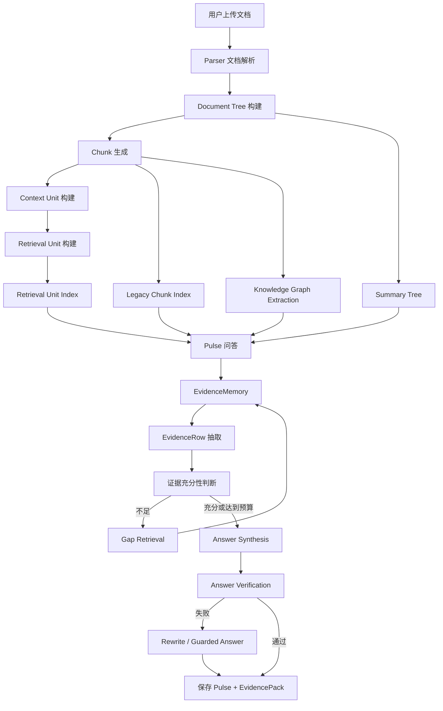

---

## 4. 主要模块划分

| 模块 | 主要职责 |
|---|---|
| Parser | 将上传文件解析为文本和基础结构 |
| Document Tree | 建立 document / section / paragraph / sentence 层级 |
| Chunk Store | 保存基础文本片段 |
| Context Index | 构建 ContextUnit 与 RetrievalUnit |
| Vector Store | 保存 legacy chunk、retrieval unit、summary node 的向量 |
| Summary Tree | 保存 paragraph / section / document 摘要 |
| Graph Extraction | 抽取节点、关系和主题 |
| PulseEngine | 处理用户问答入口和初始命中 |
| PulseEvidenceController | 控制证据收集、检索、判断、回答和校验 |
| EvidenceMemory | 保存当前问答过程中的证据状态 |
| EvidencePack | 保存最终可审计证据包 |
| Mapping Audit | 检查图谱映射质量并辅助重构 |

---

## 5. 文档导入与索引流程

### 5.1 导入流程泳道图

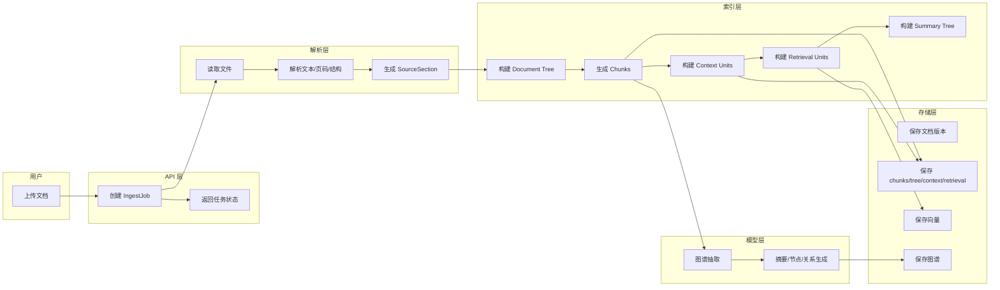

---

## 6. Document Tree

### 6.1 数据模型

Document Tree 的核心对象是 `DocumentTreeNode`。

典型字段：

```ts
interface DocumentTreeNode {
  id: string;
  libraryId: string;
  documentId: string;
  versionId: string;
  nodeType: "document" | "section" | "paragraph" | "sentence" | "table" | "unknown";
  parentId: string | null;
  childrenIds: string[];
  ordinal: number;
  level: number;
  headingPath: string[];
  text: string;
  summary: string;
  prevId: string | null;
  nextId: string | null;
  sourceChunkIds: string[];
}
```

### 6.2 设计目的

Document Tree 解决两个问题：

```text
1. 让系统知道某个 chunk 属于哪个章节、段落或句子；
2. 支持结构化检索，比如读父节点、读同节、读相邻节点、读后续节点。
```

### 6.3 对长文档问答的意义

对于判决书、合同、制度文档这类强结构材料，答案往往不在一个片段里。Document Tree 可以帮助系统从局部命中回到完整结构。

---

## 7. Chunk

### 7.1 数据模型

```ts
interface Chunk {
  id: string;
  libraryId: string;
  versionId: string;
  parentChunkId?: string | null;
  documentTreeNodeId?: string | null;
  childOrdinal?: number | null;
  parentOrdinal?: number | null;
  nodeType?: DocumentTreeNodeType | null;
  ordinal: number;
  headingPath: string | null;
  pageNumber: number | null;
  startLine: number | null;
  endLine: number | null;
  blockId: string | null;
  startChar: number;
  endChar: number;
  text: string;
  aspects: AspectKind[];
}
```

### 7.2 作用

Chunk 是最基础的证据定位单位。

它用于：

```text
全文搜索
向量搜索
图谱抽取
EvidenceRow 绑定
引用定位
父子 chunk 关联
```

---

## 8. Context Unit 与 Retrieval Unit

### 8.1 Context Unit 数据模型

```ts
interface ContextUnit {
  id: string;
  stableKey: string;
  buildId: string;
  versionId: string;
  sourceNodeIds: string[];
  primarySourceNodeId?: string | null;
  sourceRange: SourceRange;
  headingPath: string[];
  displayHeadingPath: string[];
  ordinal: number;
  ordinalInPrimarySource?: number;
  text: string;
  blocks: ContextBlock[];
  retrievalUnitIds: string[];
  estimatedTokens?: number;
  boundaryReason: string;
}
```

### 8.2 Retrieval Unit 数据模型

```ts
interface RetrievalUnit {
  id: string;
  stableKey: string;
  buildId: string;
  versionId: string;
  contextUnitId: string;
  text: string;
  headingPath: string[];
  ordinal: number;
  startChar?: number | null;
  endChar?: number | null;
  startLine?: number | null;
  endLine?: number | null;
  pageNumber?: number | null;
  estimatedTokens?: number;
}
```

### 8.3 两层上下文设计

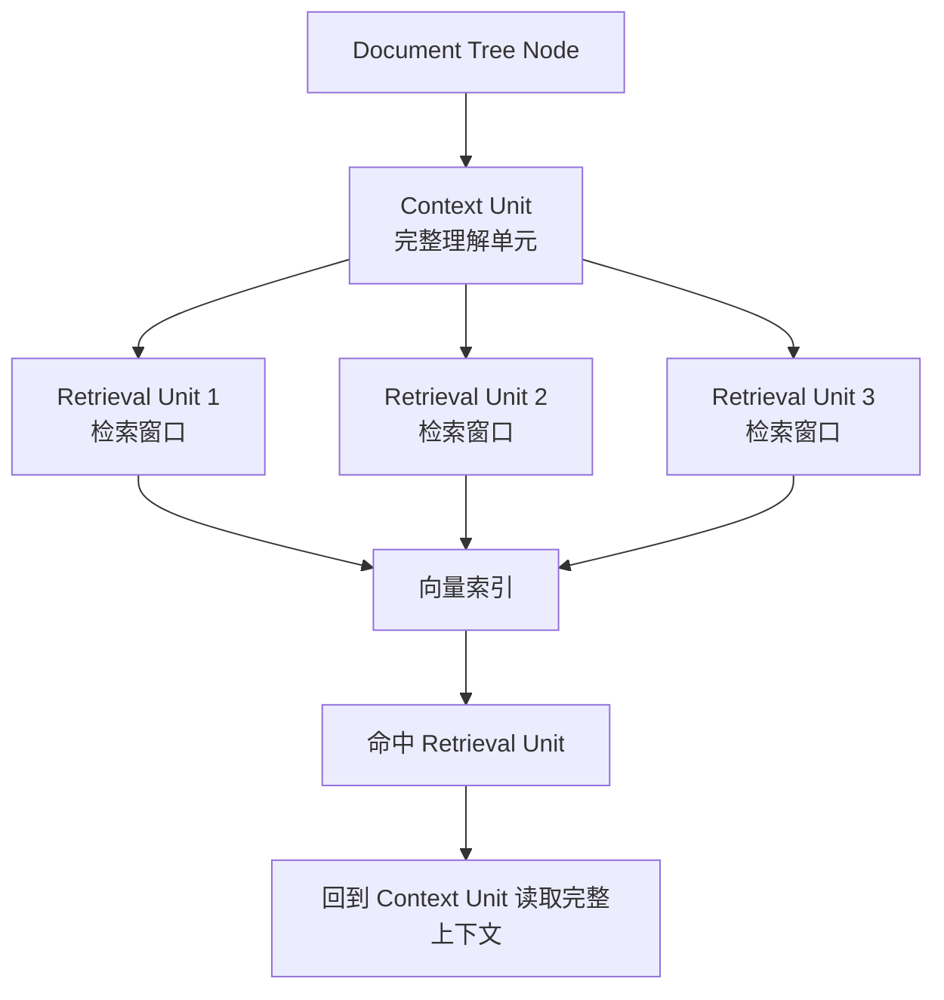

### 8.4 设计原理

如果只用 Context Unit 检索，文本太长，向量表达会被多个主题稀释。

如果只用 Retrieval Unit 回答，文本太短，容易丢上下文。

因此采用两层结构：

```text
Retrieval Unit：负责找得到
Context Unit：负责读得懂
```

---

## 9. Summary Tree

Summary Tree 用于保存不同层级的摘要。

```ts
interface SummaryTreeNode {
  id: string;
  versionId: string;
  level: "paragraph" | "section" | "document" | "cluster";
  sourceNodeIds: string[];
  summary: string;
  embeddingId: string | null;
  parentSummaryId: string | null;
  childSummaryIds: string[];
}
```

### 9.1 使用原则

Summary Tree 只用于导航和候选定位，不应作为高风险事实问题的最终依据。

```text
摘要可以告诉系统“应该去哪里找”；
原文和 EvidenceRow 才能告诉系统“答案是什么”。
```

---

## 10. 知识图谱

### 10.1 节点

```ts
interface AbstractNode {
  id: string;
  libraryId: string;
  kind: "concept" | "claim";
  title: string;
  summary: string;
  evidenceChunkIds: string[];
  citations: Citation[];
}
```

### 10.2 关系

```ts
interface Relation {
  id: string;
  libraryId: string;
  sourceNodeId: string;
  targetNodeId: string;
  type: "supports" | "contradicts" | "explains" | "depends_on" | "example_of" | "related_to";
  reason: string;
  confidence: number | null;
  evidenceChunkIds: string[];
}
```

### 10.3 图谱使用方式

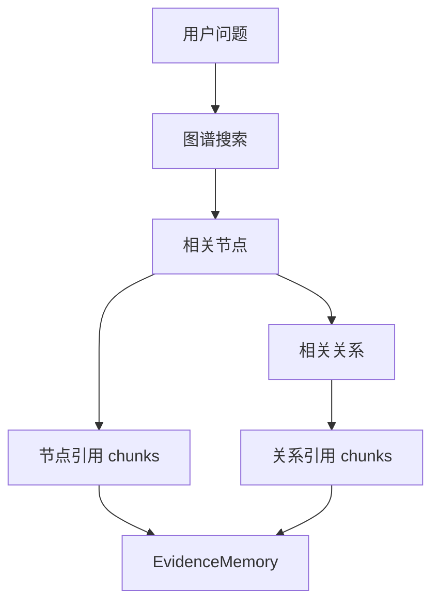

图谱用于扩大证据搜索范围，但答案仍然要回到原文证据。

---

## 11. Pulse 问答总流程

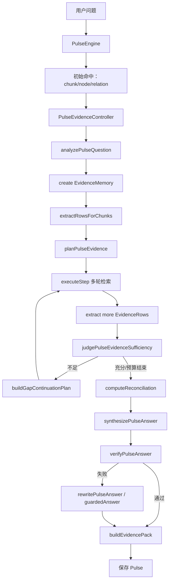

---

## 12. Pulse 问答泳道图

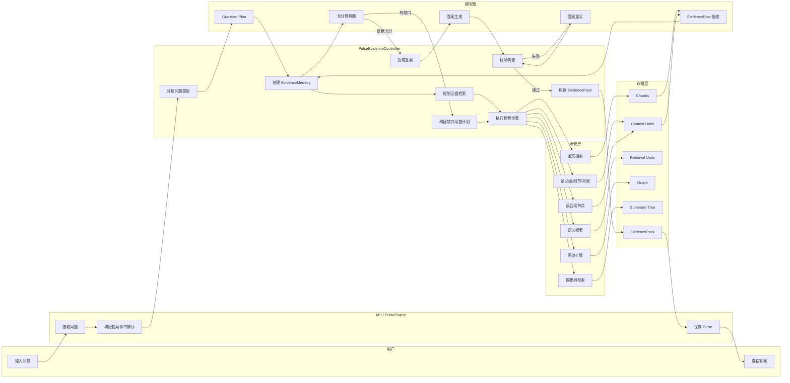

---

## 13. Question Plan

```ts
interface PulseQuestionPlan {
  questionType:
    | "normal"
    | "exhaustive_list"
    | "numerical_aggregation"
    | "timeline"
    | "entity_relation"
    | "causal_explanation"
    | "claim_support"
    | "summary"
    | "critique"
    | "comparison"
    | "mixed";
  requiresExhaustiveEvidence: boolean;
  requiresStructuredEvidence: boolean;
  requiresNumericalReconciliation: boolean;
  requiresSourceQuotes: boolean;
  requiresTimelineCompleteness: boolean;
  requiresEntityCoverage: boolean;
  allowedPartialAnswer: boolean;
  answerMustExposeGaps: boolean;
  evidenceTargets: string[];
  keyEntities: string[];
  expectedEvidenceTypes: string[];
  riskLevel: "low" | "medium" | "high";
  reasoning: string;
}
```

### 13.1 典型策略

| 问题类型 | 策略 |
|---|---|
| summary | 召回相关上下文即可 |
| normal | 需要引用，允许部分回答 |
| exhaustive_list | 需要列表覆盖、gap retrieval |
| numerical_aggregation | 需要金额抽取、闭合校验 |
| entity_relation | 需要实体覆盖与关系证据 |
| claim_support | 需要原文 quote 和支持程度判断 |

---

## 14. EvidenceMemory

### 14.1 结构说明

```ts
interface PulseEvidenceMemory {
  question: string;
  questionPlan: PulseQuestionPlan;
  collectedChunks: CompactChunk[];
  legacyChunks: CompactChunk[];
  contextUnits: ContextUnit[];
  retrievalUnits: RetrievalUnit[];
  contextBlocks: ContextBlock[];
  usedIndexProfile: "v1" | "v2";
  graphNodes: GraphNodeSummary[];
  graphRelations: GraphRelationSummary[];
  treeNodes: DocumentTreeNode[];
  parentChunks: ParentChildChunk[];
  summaryNodes: SummaryTreeNode[];
  evidenceRows: PulseEvidenceRow[];
  citedChunkIds: string[];
  retrievalHistory: RetrievalHistory[];
  retrievalTrace: RetrievalTrace[];
  currentFindings: string[];
  gaps: EvidenceGap[];
  sufficiencyHistory: PulseEvidenceStatus[];
}
```

### 14.2 设计说明

EvidenceMemory 是一次问答的状态容器，不是永久索引。它负责把“检索过程中找到的所有可用证据”组织起来，供模型判断和回答。

---

## 15. EvidenceRow

```ts
interface PulseEvidenceRow {
  rowId: string;
  evidenceType: "fact" | "amount" | "date" | "entity_relation" | "claim" | "quote" | "other";
  role?: GenericEvidenceRole;
  claimText: string;
  structuredValue?: Record<string, unknown>;
  sourceEntity?: string;
  targetEntity?: string;
  relationType?: string;
  evidenceChunkId: string;
  evidenceQuote: string;
  confidence: number;
  countedInAnswer?: boolean;
  countedInAggregation?: boolean;
  dedupeKey?: string;
  warnings?: string[];
}
```

### 15.1 Evidence Role

```ts
type GenericEvidenceRole =
  | "declared_total"
  | "stated_total"
  | "itemized_value"
  | "component_value"
  | "source_value"
  | "normalized_value"
  | "derived_value"
  | "approximate_value"
  | "excluded_value"
  | "disputed_value"
  | "background_value"
  | "unexpanded_value"
  | "supporting_claim"
  | "contradicting_claim"
  | "contextual_fact";
```

### 15.2 设计重点

金额类问题必须区分：

```text
declared_total：文档声明总额
itemized_value：分项金额
component_value：子项金额
background_value：背景金额，不应计入总额
excluded_value：排除金额
disputed_value：争议金额
approximate_value：近似金额，不能参与精确闭合
```

---

## 16. 多轮检索机制

### 16.1 检索工具集合

```ts
type PulseEvidenceTool =
  | "semanticSearchChildChunks"
  | "fullTextSearchChildChunks"
  | "retrieveParentChunks"
  | "retrieveDocumentTreeNodes"
  | "retrieveSectionSubtree"
  | "retrieveSiblingNodes"
  | "retrieveRemainingNodesAfter"
  | "retrieveSummaryTree"
  | "graphSearch"
  | "graphExpand"
  | "retrieveEvidenceForGraphNodes"
  | "buildEvidencePack";
```

### 16.2 检索控制逻辑

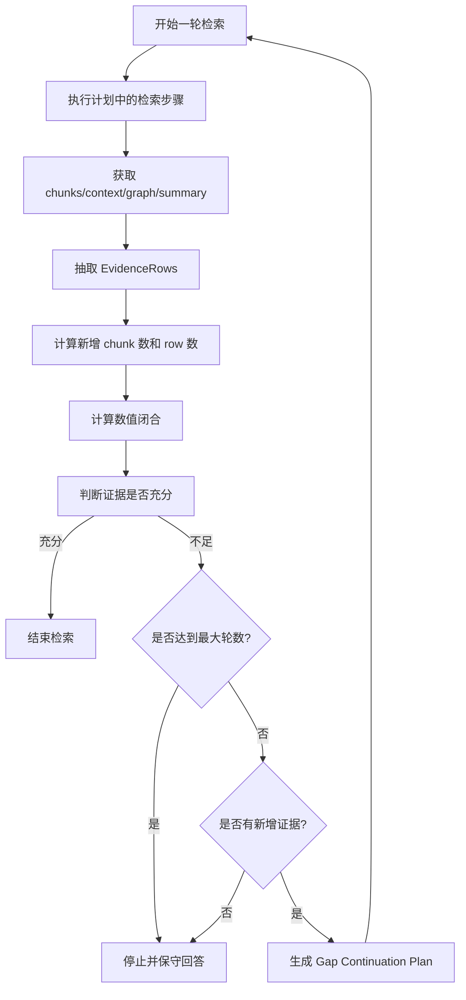

---

## 17. Gap 类型

系统主要关注这些 gap：

```ts
type EvidenceGapType =
  | "missing_itemized_evidence"
  | "declared_total_without_breakdown"
  | "sum_mismatch"
  | "missing_source_quote"
  | "missing_entity_coverage"
  | "timeline_gap"
  | "unsupported_claim"
  | "other";
```

### 17.1 Gap 到检索动作的映射

| Gap | 建议动作 |
|---|---|
| missing_itemized_evidence | 读取后续节点、同节、相邻 chunk |
| declared_total_without_breakdown | 搜索“具体如下”“分别为”“共计” |
| sum_mismatch | 查找差额来源、继续读取列表 |
| missing_entity_coverage | 搜索缺失实体名称 |
| missing_source_quote | 读取父级 chunk 或 context unit |
| timeline_gap | 搜索日期、阶段、前后节点 |
| unsupported_claim | 回到原文 quote 或删除该 claim |

---

## 18. 数值闭合机制

### 18.1 闭合计算

```ts
declaredTotal = first row where role in ["declared_total", "stated_total"]

itemizedRows = rows where:
  evidenceType == "amount"
  role is exact aggregation role
  countedInAggregation != false
  not approximate
  not background/excluded/disputed

itemizedSum = sum(itemizedRows)

difference = declaredTotal - itemizedSum

closed = abs(difference) <= tolerance
```

### 18.2 金额闭合流程图

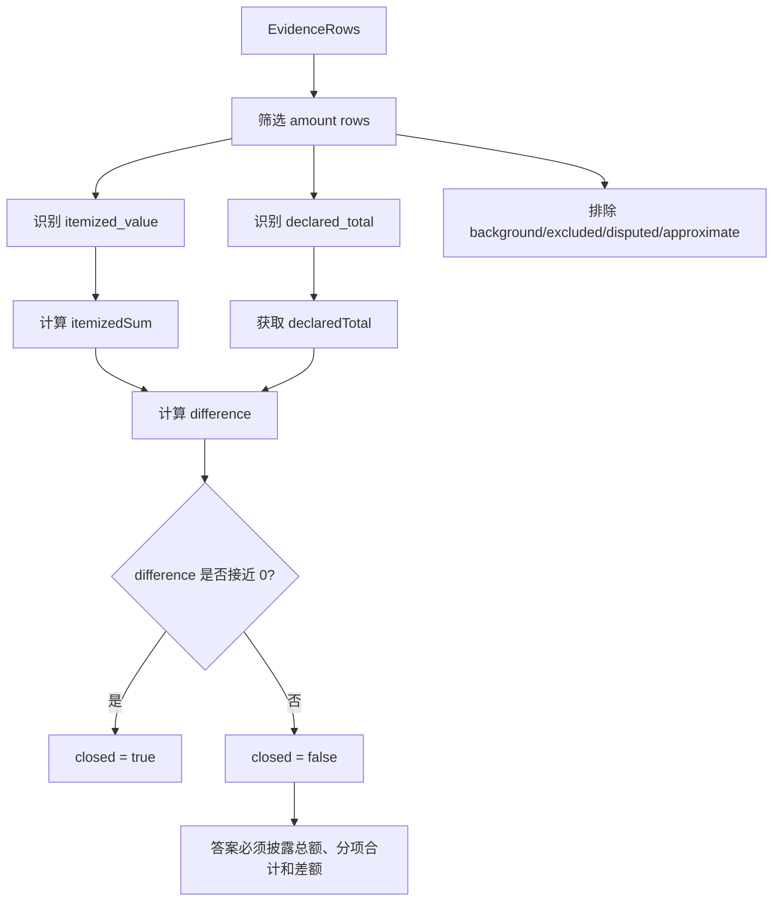

### 18.3 当前建议

对复杂法律文书、审计报告、财务说明，建议增加 FactUnit 级别闭合：

```text
document total = sum(factUnit.totalAmount)
factUnit.totalAmount = sum(factUnit.components)
```

---

## 19. Answer Verification

### 19.1 校验规则

回答生成后，系统需要检查：

```text
1. 如果要求引用，答案是否包含可核对原文引用；
2. 如果证据不足，答案是否声称“全部、完整、无遗漏”；
3. 如果数值未闭合，答案是否披露总额、分项合计和差额；
4. 如果存在 gap，答案是否明确暴露缺口；
5. 如果校验失败，是否进入 rewrite 或 guarded answer。
```

### 19.2 流程图

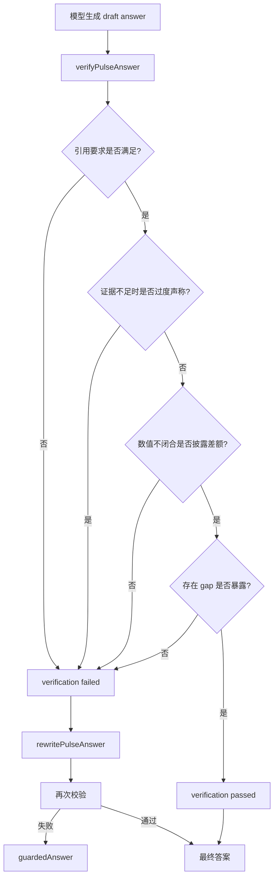

---

## 20. EvidencePack

### 20.1 作用

EvidencePack 是问答结果的审计对象。它需要保存：

```text
问题
pipeline 信息
使用的索引策略
EvidenceRows
citations
retrievalTrace
sufficiencyStatus
reconciliation
coverageWarnings
```

### 20.2 用途

```text
调试：定位错误发生在哪一环
评测：自动比较 golden answer
审计：解释答案来源
回放：复现一次问答过程
优化：找出检索和抽取短板
```

---

## 21. 上下文预算与截断策略

### 21.1 主要限制

| 阶段 | 限制 | 影响 |
|---|---:|---|
| Retrieval Unit | 约 1200 字窗口 | 检索精准，但事实可能被拆开 |
| compactChunk | 每 chunk 约 1600 字 | EvidenceMemory 可能看不到 chunk 后半段 |
| EvidenceRow 抽取 | 每 chunk 约 1800 字 | 长事实内部证据可能抽不全 |
| 每轮检索 | 约 10-12 个 chunks | 长列表需要多轮 gap retrieval |
| 检索轮数 | full 较少，progressive 较多 | 穷尽类问题可能受预算影响 |
| memorySummary | rows/chunks/units 有上限 | 最终合成可能看不到全部证据 |
| final answer | 输出 token 有上限 | 长清单答案可能被压缩 |

### 21.2 技术风险

```text
1. 同一事实被切开；
2. 金额和请托事项分离；
3. 人物和受益人分离；
4. 引用命中但上下文不足；
5. 证据抽取没看到完整原文；
6. 最终合成阶段 evidenceRows 被裁剪。
```

### 21.3 建议策略

对于 high-risk 问题，建议使用更宽松的上下文策略：

```text
增加 EvidenceRow 抽取输入长度；
提高检索轮数；
提高 final answer token；
按 FactUnit 分组保留 EvidenceRows；
对同一事实编号强制读取完整 context unit。
```

---

## 22. 推荐新增：FactUnit

### 22.1 为什么需要 FactUnit？

EvidenceRow 是单条证据，适合做结构化抽取。但对于复杂文书，很多问题的真实单位不是单条证据，而是“事实单元”。

例如：

```text
事实（一）：杨某丙相关事实
事实（二）：张某丑相关事实
事实（三）：王某己相关事实
```

每个事实单元内部包含：

```text
请托人
受益人
请托事项
收受金额
财物组成
收受方式
证据
法院认定
```

如果没有 FactUnit，模型容易把不同事实中的人物和事项串起来。

### 22.2 建议数据结构

```ts
interface FactUnit {
  factIndex: string;
  heading: string;
  sourceEntity: string;
  organization?: string;
  beneficiaries: EntityRef[];
  requestMatters: RequestMatter[];
  totalAmountWan?: number;
  components: AmountComponent[];
  evidenceRows: PulseEvidenceRow[];
  sourceChunkIds: string[];
  sourceContextUnitIds: string[];
  courtReasoning?: string[];
  warnings: string[];
  confidence: number;
}

interface AmountComponent {
  componentType: string;
  originalAmount?: number;
  originalUnit?: string;
  convertedAmountWan?: number;
  amountWan?: number;
  quote: string;
  evidenceChunkId: string;
}

interface RequestMatter {
  matterType: string;
  description: string;
  beneficiary?: EntityRef;
  resultStatus?: "completed" | "not_completed" | "partial" | "unknown";
  quote: string;
  evidenceChunkId: string;
}
```

### 22.3 FactUnit 流程

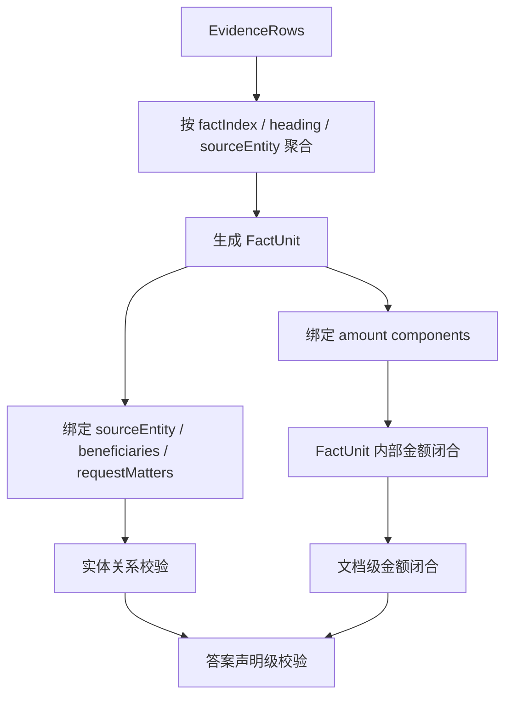

---

## 23. 推荐新增：Answer Claim Checker

### 23.1 目的

最终答案可能包含多个自然语言声明。即使证据总体充足，也可能有局部声明不被支持。

例如：

```text
张某申朋友之女报考山东警察学院
```

如果原文支持的是：

```text
张某丑朋友之女报考山东警察学院
```

系统就应发现该声明不被支持。

### 23.2 流程

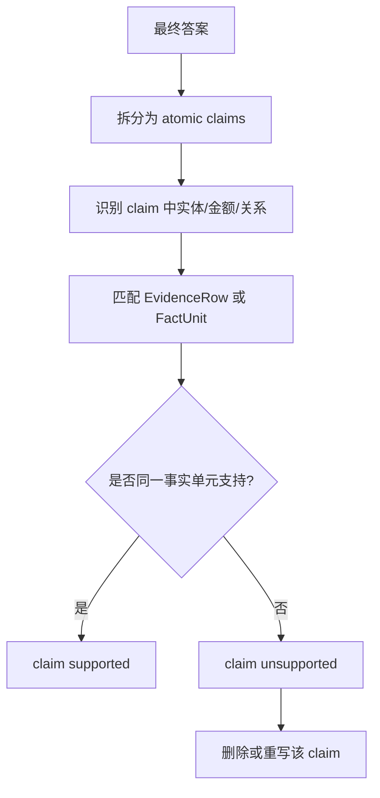

---

## 24. 推荐评测体系

### 24.1 Golden Case 结构

```ts
interface GoldenCase {
  id: string;
  documentId: string;
  question: string;
  expectedAnswer: string;
  requiredFacts: string[];
  requiredCitations: string[];
  expectedReconciliation?: {
    declaredTotal: number;
    itemizedSum: number;
    closed: boolean;
  };
  forbiddenClaims: string[];
}
```

### 24.2 指标

```text
答案正确率
证据召回率
EvidenceRow 抽取准确率
数值闭合准确率
引用准确率
实体绑定准确率
过度声称率
保守回答合理性
```

### 24.3 测试类型

| 类型 | 目的 |
|---|---|
| 普通事实问答 | 测试基本检索 |
| 穷尽列表 | 测试覆盖完整性 |
| 金额汇总 | 测试数值闭合 |
| 子项拆分 | 测试组件级闭合 |
| 实体关系 | 测试人物和事项绑定 |
| 争议说理 | 测试跨段落召回 |
| 无答案问题 | 测试拒答与缺口暴露 |
| 误导问题 | 测试是否会被错误前提带偏 |

---

## 25. 工程落地建议

### 25.1 优先级一：高风险问题上下文增强

```text
对 exhaustive_list / numerical_aggregation：
1. 提高检索轮数；
2. 提高每轮 chunk limit；
3. EvidenceRow 抽取使用完整 context unit；
4. final answer token 上调；
5. memorySummary 按事实单元保留。
```

### 25.2 优先级二：FactUnit

```text
1. 从 EvidenceRows 聚合 FactUnit；
2. 对法律文书识别（一）（二）（三）编号；
3. 每个 FactUnit 绑定 sourceEntity 和 amount；
4. 加入 FactUnit 内部闭合。
```

### 25.3 优先级三：Claim Checker

```text
1. 将最终答案拆成 atomic claims；
2. 每个 claim 绑定 FactUnit 或 EvidenceRow；
3. unsupported claim 触发 rewrite。
```

### 25.4 优先级四：评测集

```text
1. 建立真实长文档 golden cases；
2. 增加错误样例；
3. 自动检查金额、实体、引用、缺口暴露。
```

---

## 26. 总结

AgentThinking 的核心架构是：

```text
Document Tree
 → Context Unit
 → Retrieval Unit
 → EvidenceMemory
 → EvidenceRow
 → Reconciliation
 → Verification
 → EvidencePack
```

它和普通 RAG 的区别在于：

```text
普通 RAG 关注“找相关片段并回答”；
AgentThinking 关注“证据是否足够、是否闭合、是否可审计”。
```

后续最值得投入的方向不是继续堆 prompt，而是增强结构化中间层：

```text
FactUnit
Component-level Reconciliation
Answer Claim Checker
Golden Case Evaluation
```

这会让系统从“较强的知识库问答”进一步升级为“高风险事实问题可审计回答系统”。

---

## 参考资料

1. Lewis et al., *Retrieval-Augmented Generation for Knowledge-Intensive NLP Tasks*, 2020.
2. Asai et al., *Evidentiality-guided Generation for Knowledge-Intensive NLP Tasks*, 2021.
3. Jiang et al., *RAS: Retrieval-And-Structuring for Knowledge-Intensive LLM Generation*, 2025.
4. Mermaid Documentation / Mermaid text-based diagramming syntax.
